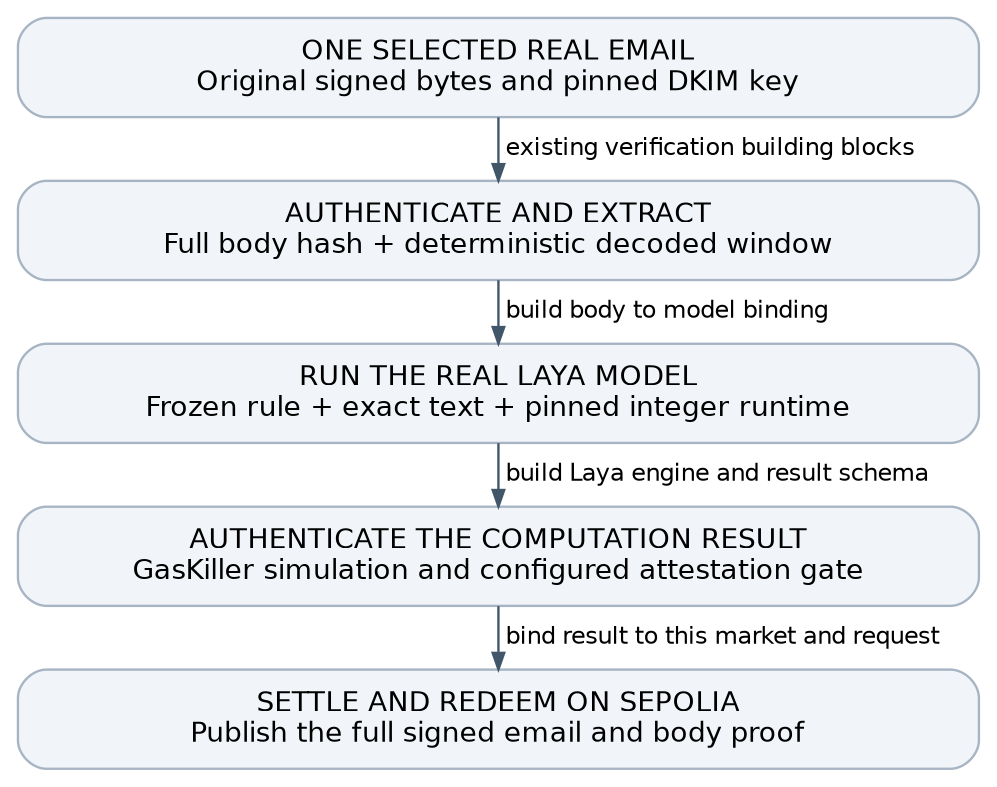

# Onchain Laya demo handoff

Means of Prediction • Implementation plan • 4 October 2026

Target completion is a reproducible Sepolia demonstration of real Laya settling a market from one genuine DKIM email: selected email, frozen factual market, Laya Solidity execution, authenticated GasKiller result, settlement and redemption. Rehearse locally, then publish the full signed email and full body proof on testnet as approved. No zero-knowledge proof or private-evidence adapter is required. The local run alone does not close issue 4. \[9, 11\]

**The smallest workable scope is one email and one market.** The local review found two real NYT fixtures with recorded verification and settlement results. Use the election email as the first candidate. A tailored historical market is acceptable when clearly labeled retrospective.

**Critical change:** the current judged market path always feeds the signed Subject to the Qwen prompt. Setting contentField to Body does not make Laya judge the body. This plan requires a new content-bound Laya path. \[1, 2\]

Completion means the real model ran and its authenticated result caused settlement and redemption on the declared network. A hardcoded verdict, mocked judge, DKIM check alone or partial layer cannot finish the goal.

## Selected email and proposed market

**Recommended candidate:** the NYT election newsletter dated 10 September 2026. It has a recorded body-proof settlement path and describes a completed election result. The existing result uses body matching on Anvil, not Laya inference. No fixture-specific Laya verdict has yet been established. \[2, 10\]

| **Field**             | **Verified metadata or recorded result**                                                                                                  |
|-----------------------|-------------------------------------------------------------------------------------------------------------------------------------------|
| Reported fact         | Foulkes defeated McKee in the Rhode Island Democratic primary; confirm the exact clause and surrounding context when freezing the fixture |
| Signed Date           | 2026-09-10 08:31:45 UTC                                                                                                                   |
| DKIM form             | d=nytimes.com; selector scph20250409; RSA-SHA256; relaxed/relaxed; no l= body truncation                                                  |
| Body shape            | 162021 bytes; single-part UTF-8 HTML; quoted-printable; recorded direct and seven-page local proof paths                                  |
| Recorded local result | Successful YES settlement and redemption; 15059245 gas recorded for the direct body-proof submission                                      |
| Raw email SHA256      | 91a062bcb77b97415f45e3d35fa9d06e22958647a9bae730e0e7d5289d917d9c                                                                          |

Verification status: a read-only metadata review matched the current raw-file hash to the archived report. It did not rerun cryptography or inference. Broader records contain 143 DKIM passes; that is not 143 end-to-end market settlements. A second real NYT unemployment fixture also has a recorded local lifecycle. \[10\]

### Proposed question

“According to The New York Times email dated 10 September 2026, did Foulkes defeat McKee in the Rhode Island Democratic primary?”

Settlement criterion: accept an explicit completed-result statement that Foulkes won or defeated McKee in that primary. Poll leads, predictions, a future contest, a different race, a quotation refuting the claim, or a statement that the result remains undecided do not support YES. Define the side mapping and neither policy before the first reference run.

Provisional expected reference: YES, inferred from the archived fact description. Independently verify the authenticated passage and freeze the label, question and criteria before invoking Laya. The model may abstain or disagree; that is a genuine gate failure, not permission to force the result.

### Why start here

The evidence already has a recorded local body-proof lifecycle, the fact is completed, and the content is a newsletter rather than an unsupported Google Alert. That narrows the remaining work to exact input binding, the real Laya runtime, authenticated result integration and the demo evidence bundle.

Alternative if this passage is unsuitable: the NYT unemployment email dated 4 September 2026 at 15:00:39 UTC, 79351 body bytes, with a recorded 8685448-gas direct local proof path. It reports unemployment holding at 4.1 percent. Use it only after the same selection and reference-verdict gates. \[10\]

## Choose the evidence before building the market

### What is already supported

The active Means branch has DKIM verification, bounded body parsing, source matching, replay protection and K-source YES settlement. The documented public body demos use synthetic body-fixture.invalid emails and regex matching. They do not prove Laya ran. The documented fresh Sepolia factory has no judge configured. \[1, 2, 3\]

### Gate 1 Select one eligible email

- Reverify the selected original RFC 822 bytes without changing line endings. Keep the recorded digest and evidence identifier; raw mail stays out of public issue text.

- Confirm the DKIM signature and the registry key provenance: signing domain and selector, signed headers, canonicalization, full-body hash coverage and any body-length limitation. A current DNS lookup alone may not establish the key valid for historical mail.

- Confirm the expected From mailbox, signed Subject, signed Date and source rule. The signed Date is a claim by the sender, not independent proof of receipt or real-world event time.

- Choose a short passage asserting a completed fact. Reject speculation, future announcements, ambiguous timing, quoted instructions and passages whose context changes the outcome.

- Check parser support on these exact bytes. Current documented limits are 196608 body bytes, 4096 encoded-window bytes and 32768 header bytes; multipart is not supported. \[2\]

- Choose the content field once. Prefer body evidence only if the selected model and authenticated body route support it. If the only candidate is a Google Alert, the newsletter v3c student is not an approved default.

### Gate 2 Freeze the market rule

Recommended template: “According to \[named source\] in its \[signed date\] email, did \[entity\] complete \[specific action\] by \[cutoff\]?” Fill this only from the selected email. Criteria must explain what counts as direct confirmation, explicit refutation, uncertainty, and irrelevant text.

Freeze the question, criteria, source identity, content field, event window and expected reference outcome before porting or tuning. Do not rewrite the market until the model happens to return YES. If the real email contains no suitable completed fact, stop and choose another eligible email or revise the demo claim with approval.

Use K=1 as an explicit single-source demo configuration. Include the historical signed Date in windowStart, but use a future submission deadline as required by the current initializer. This does not validate production source-diversity or market-origination rules. \[1\]

### Publication check

Full signed email and body-proof disclosure is approved for this demo; ordinary address and body visibility are accepted. No ZK privacy path is needed. Before publication, scan the exact bytes for live authentication or account-access credentials and unapproved sensitive third-party data. If found, stop that upload for owner handling or choose a safe genuine fixture; do not redact signed bytes and claim the original DKIM remains valid. Synthetic fixtures remain tests, not substitutes for the real-email goal. \[2, 11\]

## Bind the email to the model and the market

Proposed integration contract: introduce a versioned Laya evidence request and result. Keep the existing Qwen ABI intact unless a separately reviewed migration is necessary. All fields below must be deterministically encoded and checked, rather than carried only in a log or UI label.

| **Commitment**         | **Minimum content and check**                                                                                                                                 |
|------------------------|---------------------------------------------------------------------------------------------------------------------------------------------------------------|
| Market and rule        | Chain ID, market address or canonical ID, question and criteria hash, source rule hash, K, timing configuration and schema version                            |
| Authenticated evidence | Email digest, DKIM signature nullifier, verified source/key identity, signed date, full-body commitment, parser version and selected content field            |
| Exact Laya input       | Decoded bytes digest, window offset and length, extraction rule, input-template hash, tokenizer hash, token IDs digest, truncation and sequence-length policy |
| Model and runtime      | Exact checkpoint and side-head weights, model config, quantization/scales, integer runtime code hash, weight-chunk root and adapter version                   |
| Result and freshness   | Request ID/nonce, support/refute/neither output, per-side integer scores, threshold and tie policy, request validity or expiry, attestation/proof format      |

### Authenticated bytes must be the bytes the model sees

Derive or verify the decoded window from the full authenticated body, then normalize and tokenize under a fixed, committed procedure. Bind both bytes and token IDs into the request. Reject independently supplied excerpts. Preserve enough context for negation, tense and attribution.

DKIM authenticates source text under the key policy; Laya judges the fixed rule against it. Neither proves the real-world claim. Keep the market source-attributed.

### GasKiller integration

Execute the complete pinned Laya Solidity engine in the tracked simulation path. Authenticate its result through the actual configured GasKiller and Means verifier/quorum path, and reject unbound or stale results. The existing Means LLMJudge is quorum-attested and maps Qwen answer tokens; it is not a Laya implementation or a per-answer zero-knowledge proof. Record the exact trust assumption in the demo. \[4, 6\]

Public testnet route: use Sepolia after a fresh deployment/verifier check. Publish the selected complete signed email and canonical body through the existing full-body or paginated body-proof route, then use the new content-bound Laya adapter. Ordinary email disclosure is accepted. Keep the credential/sensitive-data scan as the remaining publication check; do not add a ZK or private-evidence dependency. \[11\]

On receipt, the market must check the bound market, rule, evidence, model and request; permit a valid supported outcome once; and reject duplicate results. Do not translate timeout, malformed output, low confidence or “neither” into YES. Do not claim a cryptographic inference proof unless that proof is actually generated and verified.

## Port Laya with an early feasibility gate

### Model selection

Use the existing newsletter v3c epoch 2 student only when the selected evidence is a supported newsletter. The handoff identifies per-side A/B heads and a 0.4 threshold fixed on training-market rows; the choice head is not the intended decision path. Preserve the A/B label meaning from the exact training artifact. These artifact identifiers and calibration settings must be verified locally before they become deployment constants. \[5\]

The local model.safetensors is 1685197088 bytes; weights, tokenizer and config hashes still need pinning. No verdict for this email is established. \[10\] The benchmark selects A when pA is at least pB, otherwise B, and returns neither when the larger score is below the side threshold. This makes ties choose A. Preserve that behavior for parity, or explicitly version and revalidate a different policy. Do not silently change head choice, threshold, tie handling or abstention during the port. \[5\]

### Reuse the math rather than the Qwen architecture

The Solidity Qwen implementation provides reusable Q24 integer activations, quantized matmul, streaming scratch, Q32 exponential and RoPE building blocks. The overlay design pins weights and tokenizer while keeping large weight data offchain. Preserve the AGPL-3.0-only licensing obligations of reused code. \[6, 7\]

Laya needs its own encoder semantics. Upstream configuration describes ModernBERT with bidirectional full/sliding attention, LayerNorm and GELU-gated feed-forward layers. Confirm every layer, dimension, attention pattern, positional rule, pooling step and classifier head against the selected checkpoint. Qwen causal attention, KV-cache behavior, RMSNorm and SwiGLU cannot simply be reused unchanged. \[8\]

### Gate 3 Measure before committing to the full port

- Build an exact integer reference for the chosen tokenizer, quantization and runtime policy. Separately measure drift from the frozen original model; agreement with a new integer reference alone does not establish semantic fidelity.

- During the discovery spike, audit missing operators and attempt a representative kernel or layer profile. A 4–8 hour timebox does not promise a complete integer reference. Before full implementation, record a conservative sequence-shape budget; later measure the full engine. A one-layer result remains a milestone.

- Run the full real checkpoint end to end before advertising feasibility. Pin streamed weight chunks and reject missing, reordered or mutated chunks. Record the exact byte hashes and code version.

- If the full runtime cannot meet the measured simulation budget, stop and return the bottleneck. Do not call a partial model, hardcoded verdict, closed teacher model or Qwen answer-token substitution “Laya onchain”.

### Protect the evaluation boundary

Use approved training/development material only; never learn from or tune to the sealed held-out set. Retrospective one-email success establishes an integration path, not prospective accuracy, broad settlement safety or customer revenue.

## Implementation work packages

Estimates below are engineering planning ranges, not booked time or delivery promises. They assume the existing repositories and required artifacts are accessible. A full runtime estimate should follow the feasibility gate; there is no evidence yet for a reliable end-to-end calendar commitment.

| **Package**           | **Output and exit condition**                                                                                                                               | **Effort**        |
|-----------------------|-------------------------------------------------------------------------------------------------------------------------------------------------------------|-------------------|
| 1 Evidence and rule   | Selected email passes verification, parser and credential checks; source-attributed rule and reference verdict are frozen; full-body disclosure is approved | 2–4 h             |
| 2 Artifact manifest   | Checkpoint, heads, tokenizer, config, threshold, reference vectors and licensing are pinned; no undocumented defaults                                       | 2–4 h             |
| 3 Runtime feasibility | Timeboxed discovery: artifact/operator audit, initial kernel or profile attempt, measured risks and a revised implementation estimate                       | 4–8 h discovery   |
| 4 Full Laya runtime   | Every required layer and head runs with streamed pinned weights; parity and original-model drift gates pass                                                 | Estimate after 3  |
| 5 Bound judge path    | Versioned request/result, body-to-input binding and GasKiller authentication wired to the market; adversarial unit tests pass                               | 1–2 days after 4  |
| 6 Demo and receipts   | Local Laya rehearsal, then full-email Sepolia settlement and redemption; reproducibility bundle and transaction links                                       | 0.5–1 day after 5 |

### Suggested code touchpoints

- Means market and adapter: HeadlineMarket.sol, a new Laya-specific judge interface/adapter, and explicit content-field handling. Preserve existing Qwen compatibility.

- Evidence parser: reuse DKIMVerifier and BodyParser only after exact-fixture tests; add a committed derivation from decoded window to Laya input.

- Runtime and scripts: build the Laya Solidity encoder alongside the Qwen runtime primitives; add deterministic checkpoint export, manifest and parity harness.

- Integration tests: exercise the actual runtime and authenticated callback path, then assert market balances, one-time settlement and redemption.

### Stop gates and required decisions

- If the exact passage is unsuitable or parser checks fail, stop and assess the alternative real fixture.

- No exact local model artifact, tokenizer or label map: stop before implementation constants are frozen.

- Full Laya execution exceeds the simulation budget or changes the frozen outcome: return measured evidence and a revised technical option.

- Live credentials or unapproved sensitive third-party data found in the bytes: stop the upload for owner handling or choose a safe real fixture. Ordinary address/body visibility is approved.

- Actual verifier/quorum or target deployment configuration is unavailable: treat settlement as blocked, even if local inference succeeds.

Execution scope: full-email/body publication is approved for the demo. This document performs no transaction or publication and does not authorize spending, real-money markets, new accounts or keys, production changes or calendar scheduling. Use development or testnet-only assets.

## Acceptance tests and completion evidence

| **Case**                    | **Expected result**                                                                                                                           |
|-----------------------------|-----------------------------------------------------------------------------------------------------------------------------------------------|
| Real positive fixture       | Exact approved email and frozen rule produce the reference Laya verdict; authenticated result settles the bound market; winning shares redeem |
| One altered signed byte     | DKIM/header or body authentication fails before judgment; no settlement                                                                       |
| Unrelated or wrong window   | Semantic result is neither or request is rejected; no YES settlement                                                                          |
| Explicit refutation         | The semantic harness returns the correct opposite side; it cannot be accepted as support for the original rule                                |
| Future or ambiguous wording | Returns neither under the frozen criteria; no YES settlement                                                                                  |
| Altered model or tokenizer  | Commitment check fails, including one mutated or missing streamed weight chunk                                                                |
| Tampered result binding     | Wrong chain, market, rule, email, window, model, request or expiry is rejected                                                                |
| Replay                      | Duplicate email nullifier or completed request cannot increment evidence or settle again                                                      |
| Fault and abstention        | Timeout, failed simulation, bad attestation, malformed scores and low confidence cannot settle YES                                            |
| Redemption accounting       | Balances and payout receipts match the contract rule; repeat redemption cannot pay twice                                                      |

Test boundary: mutated or invented text is not a valid original DKIM email. Run such semantic fixtures at the model layer, or label test-signed fixtures as synthetic. If no genuine authenticated refutation or irrelevant message is available, record that end-to-end coverage gap rather than claiming it passed.

### Short demo script

1.  Show the frozen question, source rule, retrospective label, model manifest and complete approved email evidence after the credential/sensitive-data scan.

2.  Run the full pinned Laya Solidity simulation on the authenticated decoded text. Show the input digest, side scores, threshold, verdict, runtime hash and authenticated result reference.

3.  Rehearse locally, then submit the full email/body proof and bound result through the configured Sepolia path. Show settlement and redemption explorer receipts and balances; replay a used result to demonstrate rejection.

### Definition of done

A reviewer can reproduce the pinned run, verify the real email under the stated key policy, confirm the same text reached Laya, and trace the accepted result to settlement and payout. Include tests, resource measurements, remaining gaps and trust assumptions. A local run proves only local integration. Close the testnet criterion only after the real public flow and linked settlement/redemption receipts pass.

Current resolveNo uses deadline plus buffer to settle NO; it does not implement the research roadmap’s full void/abstention semantics. Keep this demo centered on the successful YES path and disclose that timeout and production settlement-policy completeness remain separate work. \[1\]

## Sources and developer handoff checklist

Reference snapshot checked on 4 October 2026; local Means HEAD cab13a4 on the active research branch. Repository links below identify the reviewed branch and files. Before implementation, resolve them to immutable commit hashes and record those hashes in the manifest. Source code and documented examples establish building blocks; they are not evidence that this Laya demo has already run.

[\[1\] Means HeadlineMarket source](https://github.com/RonTuretzky/means-of-prediction/blob/RonTuretzky/replace-astra-with-fable-research/contracts/src/market/HeadlineMarket.sol)

[\[2\] Means body parsing documentation](https://github.com/RonTuretzky/means-of-prediction/blob/RonTuretzky/replace-astra-with-fable-research/docs/BODY-PARSING.md)

[\[3\] Means DKIM verifier source](https://github.com/RonTuretzky/means-of-prediction/blob/RonTuretzky/replace-astra-with-fable-research/contracts/src/dkim/DKIMVerifier.sol)

[\[4\] Means LLM judge source](https://github.com/RonTuretzky/means-of-prediction/blob/RonTuretzky/replace-astra-with-fable-research/contracts/src/judge/LLMJudge.sol)

[\[5\] Means Laya benchmark and side-head decision behavior](https://github.com/RonTuretzky/means-of-prediction/blob/RonTuretzky/replace-astra-with-fable-research/app/scripts/research/blind/laya_bench.py)

[\[6\] GasKiller Solidity Qwen runtime building blocks](https://github.com/gas-killer/solidity-sdk/blob/RonTuretzky/onchain-solidity-llm/src/examples/onchain-llm/Qwen3.sol)

[\[7\] GasKiller hash-pinned unbounded overlay design](https://github.com/gas-killer/solidity-sdk/blob/RonTuretzky/onchain-solidity-llm/src/examples/onchain-llm/UNBOUNDED_V2_OVERLAYS.md)

[\[8\] Upstream Laya encoder configuration to compare with the local artifact](https://huggingface.co/convaiinnovations/laya/raw/main/encoder/config.json)

[\[9\] Means issue 4 target](https://github.com/RonTuretzky/means-of-prediction/issues/4)

\[10\] Read-only local artifact review on 4 October 2026: fixture hashes and archived body-e2e reports, checkpoint metadata and file presence. No cryptographic rerun, model inference or sealed evaluation-row inspection was performed.

\[11\] User direction on 4 October 2026 accepts full signed-email and full-body-proof disclosure for this demo and removes any zero-knowledge requirement.

### Handoff checklist

- Use issue 4 for this integration and preserve its existing assignee. Agree the separate verifiable-execution owner before implementation. Update the existing issue rather than create a duplicate; keep broader alert research and generic model comparison outside this demo.

- Fill the evidence manifest and exact question first. Record whether the email is newsletter or alert and which verification level has actually passed.

- Freeze the reference verdict and all model/configuration hashes. Preserve a clear separation between original-model quality and Solidity implementation parity.

- Complete the feasibility spike and report a go/stop recommendation with measured resource limits before estimating the remaining runtime work.

- After implementation, deliver a reproducibility bundle, full-email fixture instructions, demo assets, test report, transaction links and a concise list of incomplete gates.

### First concrete step

Inspect the available real email and exact local Laya student. Verify the bytes and completed newsletter fact, then freeze the question, criteria and independently assigned reference label. Run the frozen model on that specification. If it abstains or disagrees, record the failure; do not retune the model or reword the question merely to force a passing demo.
